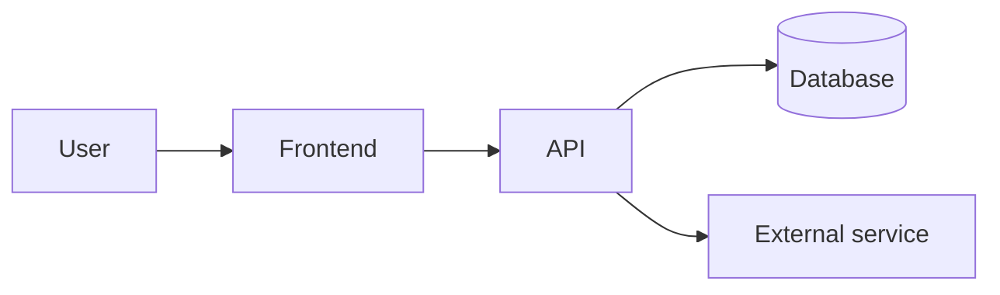

# TenOrNot Architecture

<!-- The current shape of the system across all features. Per-feature technical detail lives in specs/NNN-*/plan.md. The "why" behind choices lives in docs/adr/. Update this when components or their connections change. -->

**Last updated:** 2026-10-01

## Overview
[Two or three sentences: what the major pieces are and how a request flows through them.]

## Components
| Component | Responsibility | Location | Tech |
|-----------|----------------|----------|------|
| [Frontend] | [What it does] | `src/...` | [e.g. Angular] |
| [API] | [What it does] | `src/...` | [e.g. ASP.NET Core] |
| [Database] | [What it stores] | `db/...` | [e.g. SQL Server] |

## Data
[Key entities and relationships. Link to schema/migrations rather than copying them.]

## External Integrations
| Service | Used for | Auth | Failure behavior |
|---------|----------|------|------------------|
| [Service] | [Purpose] | [API key / OAuth] | [Retry, degrade, fail] |

## Cross-Cutting Concerns
- **Auth:** [approach]
- **Config and secrets:** [approach]
- **Logging / observability:** [approach]
- **Error handling:** [approach]

## Deployment
[Where it runs (local Docker, Azure, etc.), how it gets there, environments.]

## Key Decisions
See `docs/adr/README.md` for the full list.
