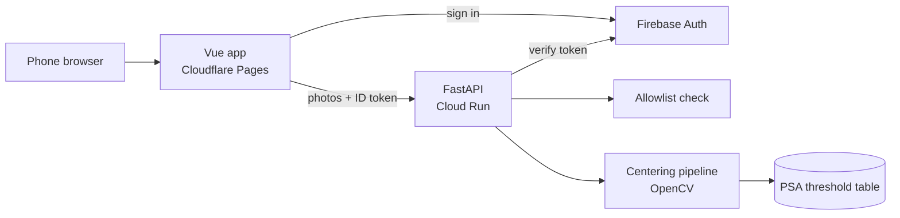

# TenOrNot Architecture

<!-- The current shape of the system across all features. Per-feature technical detail lives in specs/NNN-*/plan.md. The "why" behind choices lives in docs/adr/. Update this when components or their connections change. -->

**Last updated:** 2026-10-01

## Overview
The Vue app runs in the phone browser, signs the user in with Firebase, and sends front and back photos with the Firebase ID token to the FastAPI backend on Cloud Run. The backend verifies the token, checks the email allowlist, runs the centering pipeline in memory (detect card → straighten → measure borders → look up max grade), and returns the result. Nothing is stored.

## Components
| Component | Responsibility | Location | Tech |
|-----------|----------------|----------|------|
| Frontend | Camera capture, upload, results, retake advice, sign-in | `frontend/` | Vue 3 + TypeScript |
| API | HTTP endpoints, token verification, allowlist, error format | `backend/` | FastAPI |
| Centering pipeline | Detect, straighten, measure L/R and T/B, reason codes | `backend/` (pure module) | Python + OpenCV |
| Grade thresholds | Centering limits per PSA grade, front and back | `backend/` (data table) | Python |

## Data
No database or stored photos in v1. Key result shape per side: `side`, `lr` and `tb` ratios (larger-first), `maxGrade`, `borderlineWith`, and a straightened preview image with the measured design edges, or a reason code when the photo can't be measured. Full shapes: `specs/001-capture-centering/data-model.md`.

## External Integrations
| Service | Used for | Auth | Failure behavior |
|---------|----------|------|------------------|
| Firebase Auth | Google/GitHub sign-in, ID tokens | Firebase project config | Can't sign in; app unusable until it's back |

## Cross-Cutting Concerns
- **Local dev:** Vite proxies `/api` to the backend on `:8000` (no CORS until deployment). Until capability 2, the API runs locally without auth.
- **Auth:** Firebase ID token on every request; backend verifies it and checks the email against the allowlist env var.
- **Config and secrets:** env vars; local `.env` files gitignored.
- **Logging / observability:** stdout → Cloud Logging (built into Cloud Run). Never log photo data.
- **Error handling:** see `CLAUDE.md` Conventions (reason codes for unmeasurable photos, one error format).

## Deployment
Frontend on Cloudflare Pages, backend on Cloud Run. How it gets there is defined in capability 3's spec.

## Key Decisions
See `docs/adr/README.md` for the full list.
